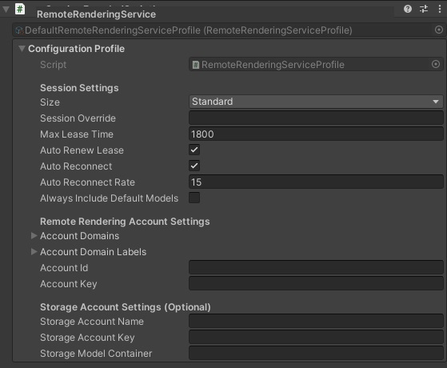

# Starting & Configuring Sessions in App
To use this application, you'll have to start a new Azure Remote Rendering session. To start a session click the *session* button, and then click *start session*. Starting a session will take a few minutes. However once the session is ready, the app will automatically connect to it. The app will also remember the created last session, and will automatically connect to this session at start-up.

Within the app, you can also change the [session's size](https://docs.microsoft.com/azure/remote-rendering/reference/limits#overall-number-of-polygons)
 (*Standard* or *Premium*) and [region](https://docs.microsoft.com/azure/remote-rendering/reference/regions). Before starting a session, click the *configure* button. You'll be presented with size and region options. After selecting the desired configuration, click *back* and start a new session.

# Controlling & Configuring Sessions in Editor

Search for the *RemoteRenderingService* object under the *MixedRealityToolkit* node in the hierarchy window, and select this object. It holds the configuration properties as shown in the next paragraph.

## Configuration Profile

The *RemoteRenderingService* object is a custom Mixed Reality Toolkit (MRTK) extension service. As with all MRTK services, the *RemoteRenderingService* object has a configuration profile. With this custom profile you can setting a variety of app properties, they include the following:

 

| 
 Session Setting
 | Description                                                                                                                     |
| :------------------ | :---------------------------------------------------------------------------------------------------------------------------------------------------------- |
| Size                | The ARR session size, either *Standard* or *Premium*. See [limitations of session sizes](https://docs.microsoft.com/azure/remote-rendering/reference/limits#overall-number-of-polygons).    |
| Session Override    | Either a session guid or a session host name. If specified, the app will attempt to connect to this session. |
| Max Lease Time      | The default lease time, in seconds, of the ARR session. If *auto renew lease* is false or the app is disconnected, the session will expire after this time. |
| Auto Renew Lease    | If true and the app is connected, the app will attempt to extend the ARR session lease before it expires.                                                   |
| Auto Reconnect      | If true, the app will attempt to auto reconnect after a disconnection.                                                                                      |
| Auto Reconnect Rate | The rate, in seconds, in which the app will attempt to reconnect after a disconnection.                                                                     |

 

> All settings are optional if you set these values via a [arr.account.xml](../arr-showcase-app/Assets/StreamingAssets/arr.account.xml) file. The [arr.account.xml](../arr-showcase-app/Assets/StreamingAssets/arr.account.xml) file can be placed under Unity's *StreamingAssets* directory. If this file exists, the app will use the settings within the file, instead of those within the configuration profile.
> 
> The [arr.account.xml](../arr-showcase-app/Assets/StreamingAssets/arr.account.xml) file is not tracked by *git* (as defined in the app's [.gitignore](../.gitignore)), preventing accidental commits of private/secret information. So it is preferred to use [arr.account.xml](../arr-showcase-app/Assets/StreamingAssets/arr.account.xml) instead of adding your private account settings to the MRTK's configuration profile.
>
> Additionally the [arr.overrides.xml](.samples/arr.overrides.xml) can be used to override settings even if the app has already been packaged and deployed. The [arr.overrides.xml](.samples/arr.overrides.xml) file needs to be placed in the "C:/Users/&lt;username&gt;/AppData/LocalLow/Microsoft/ARR Showcase" folder on PC or in the "LocalState" folder of your app package on HoloLens. The file should only contain the settings you want to override.

 

| 
Remote Rendering Account Settings
 | Description                                         |
| :---------------------- | :------------------------------------------------------------------------- |
| Account Domains         | A list of (up to 4) full [ARR account domains](https://docs.microsoft.com/azure/remote-rendering/reference/regions) (e.g. westus2.mixedreality.azure.com). The list order defines the order in which the domains are tested.
| Account Id              | The [ARR account ID](https://docs.microsoft.com/azure/remote-rendering/how-tos/create-an-account#retrieve-the-account-information).
| Account Key             | The [ARR account key](https://docs.microsoft.com/azure/remote-rendering/how-tos/create-an-account#retrieve-the-account-information)
| Storage Account Name    | The [ARR storage account name](https://docs.microsoft.com/azure/remote-rendering/how-tos/create-an-account#link-storage-accounts). This account owns the *model container*.
| Storage Account Key     | The Azure Storage Account key. Needed if the *model container* is private.
| Storage Model Container | The Azure Storage Container that contains a set of arrAsset model files.

Changed settings will be applied the next time you click *play* in editor, or by clicking the *apply configuration button* during play mode.

For more information about custom MRTK extension services, visit the MRTK [documentation](https://microsoft.github.io/MixedRealityToolkit-Unity/Documentation/Extensions/ExtensionServices.html).

## Play mode
When in 'play' mode, the inspector also shows various buttons interact with the session, including extend, stop, and forget the current session. Note that "forget" won't stop the remote session, but it'll prevent the app from using this session again.

> [!IMPORTANT]
> It is not possible to create or interact with sessions outside the editor's play mode.

# Voice Commands

Here are all the general voice commands supported by the sample app:

| 
Command
 | Description                                                                        |
| :------------------------- | :--------------------------------------------------------------------------------------------- |
| Showcase, Erase All        | Deletes all models from the scene
| Showcase, Show Hands       | Shows hand mesh
| Showcase, Hide Hands       | Hides hand mesh
| Showcase, Show Local Stats | Shows the MRTK diag window
| Showcase, Hide Local Stats | Hides the MRTK diag window
| Showcase, Show Stage       | Shows a local stage visual. Once visible, all new models will be loaded on the stage.
| Showcase, Hide Stage       | Hides the local stage visual. Once hidden, all new models will have to be placed individually.
| Showcase, Move Stage       | Show and move the local stage visual.
| Showcase, Show Menu        | Show the main menu
| Showcase, Hide Menu        | Hide the main menu
| Showcase, Quit             | Quits the application
| Showcase, Tools            | Show or hide the tools menu.
| Showcase, Models           | Show or hide the models menu.
| Showcase, Session          | Show or hide the session menu.
| Showcase, Stats            | Show or hide the stats menu.

Here are all the tool 'mode' voice commands supported by the app. These change the mode of the pointer.

| 
Command
 | Description                                                                                       |
| :------------------------- | :------------------------------------------------------------------------------------------------------------ |
| Showcase, No Tool          | Unselects the current pointer tool, so you can no longer interact with the models.
| Showcase, Clip             | Puts the pointer into clip or slice mode. This also turns on a single clipping plane.
| Showcase, Erase            | Puts the pointer into erase mode. When a model is clicked, the entire model will be deleted from the scene.
| Showcase, Explode          | Puts the pointer into explode mode. When a model is clicked, its pieces will explode outward from the center.
| Showcase, Move All         | Puts the pointer into move mode. When a model is clicked and held, the entire model will be moved, scaled, or rotated.
| Showcase, Move Piece       | Puts the pointer into move piece mode. When a model piece is clicked and held, the piece will be moved, scaled, or rotated.
| Showcase, Revert           | Puts the pointer into revert mode. When a model is clicked, the model pieces will return to the original position relative to the model's root.
| Showcase, Reset            | Puts the pointer into revert mode. When a model is clicked, the model pieces will return to the original position relative to the model's root.
| Showcase, Slice            | Puts the pointer into clip or slice mode. This also turns on a single clipping plane.

# App Features
This sample app has the following features:

| 
Feature
 | Description |
|-------------|-----------|
| Session Management | Start, stop, and configure ARR sessions.|
| Session Status | View the session's lifetime, and various other performance statistics |
| Search Azure Containers | Search Azure containers for arrAsset models, and display the model names within the app's model menu. From the model menu, you can load these models. |
| Multiple Models | View multiple models at once.
| Manipulate Whole Model | Use MRTK's near and far interactions to move, rotate, and scale whole models.
| Manipulate Model Pieces | Use MRTK's near and far interactions to move, rotate, and scale model pieces.
| Slice Tool | Turn on a clipping plane that can be moved and rotated with MRTK's near and far interactions.
| Model Explosion | For easier access of pieces, explode a model.
| Change Model Materials | Change model pieces' materials.
| Reset Models | Reset a model so its pieces return to their original positions and materials.
| Erase Models | Erase whole models from the scene.
| Change Sky Map | Change the scene's sky map to a predefined set of cube maps.
| Add light sources | Add point lights, directional lights, and spotlights to the scene.