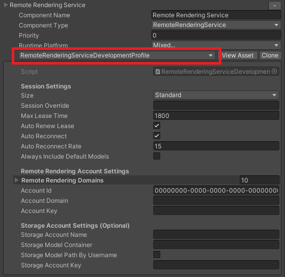
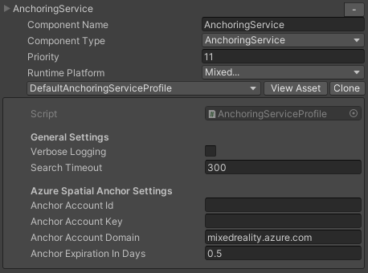
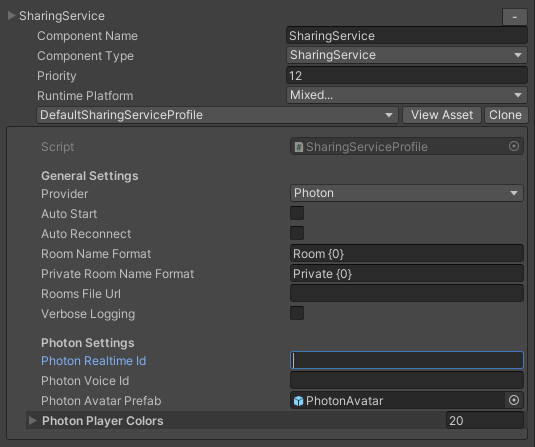

# Build and configure the application

## Setup your dev environment

* Be sure all required software is installed
  * [Visual Studio 2022](https://visualstudio.microsoft.com/vs/)
  * [Windows SDK 18362+](https://developer.microsoft.com/windows/downloads/windows-10-sdk)
  * [Latest Unity 2020.3.x LTS](https://unity.com/releases/editor/qa/lts-releases?version=2020.3)
* Open the `App` directory with Unity 2020.3
* Switch Unity's platform to `Universal Windows Platform` by using the *File > Build Settings...* menu item.

## Setup remote rendering cloud services

> [!NOTE]
> Please note that Azure Remote Rendering (ARR) will be retired on **September 30, 2025**. It is no longer possible to create new accounts if your subscription did not have an active ARR account previously.
> More details [here](https://azure.microsoft.com/en-us/updates/v2/azure-remote-rendering-retirement).

* Ensure you have created an Azure Remote Rendering account. If you do not already have an account, create one using the [Create an Azure Remote Rendering account](https://learn.microsoft.com/azure/remote-rendering/how-tos/create-an-account#create-an-account) manual.
* Ensure you have an Azure Storage account, with models store in a Azure blob container.  To set that up a new storage account, see the [Convert a model for rendering](https://docs.microsoft.com/azure/remote-rendering/quickstarts/convert-model) manual.

## Setup collaboration cloud services

* Ensure you have added ExitGame's Photon Voice 2 assets into your project. To add this plug-in, follow the [Using Photon Voice 2 for Collaboration](implementation-notes.md#using-photon-voice-2-for-collaboration) instructions within this repository.
* Showcase can be optionally built with Azure Spatial Anchors enabled. In that case you need to have an Azure Spatial Anchors account. However, you can't create new accounts as Azure Spatial Anchors will be retired on November 20, 2024. More information can be found [here](https://azure.microsoft.com/updates/azure-spatial-anchors-retirement.).
* To use ASA, ensure you have added the Azure Spatial Anchors packages to your project. To add the packages, follow the [Azure Spatial Anchor Service Extension](implementation-notes.md#azure-spatial-anchor-service-extension) instructions within this repository.

## Configure application

Choose if you want to configure the application using a [configuration file](#configure-application-with-a-configuration-file) or directly in the [Unity Editor](#configure-applications-remote-rendering-in-unity-editor).  Configuring in the Unity Editor is the most expedient option but risks exposing credentials through source control causing a security breach.  A configuration file keeps all credentials in one place and reduces the likelihood credentials will be leaked publicly.

## Configure application with a configuration file

* Create a `StreamingAssets` directory under [`App\Assets`](../App/Assets)
* Copy the sample [`arr.account.xml`](samples/../.samples/arr.account.xml) file from [`.documents\samples\arr.account.xml`](samples/../.samples/arr.account.xml) into the `App\Assets\StreamingAssets` directory
* Fill in each section with the corresponding account details

The `.gitignore` file in the project excludes the [`arr.account.xml`](samples/../.samples/arr.account.xml) file.  This prevents accidental commits of private/secret information. It is preferred to use [`arr.account.xml`](samples/../.samples/arr.account.xml) instead of configuring your services through the Unity Editor.

## Configure application's remote rendering in Unity Editor

>Note that configuring in Unity is not needed if you used a configuration file as detailed in the section above

* Open the [`SampleScene`](../App/Assets/Scenes/SampleScene.unity) scene.
* Find the `MixedRealityToolkit` object within the scene hierarchy, select it to show the Mixed Reality Toolkit configuration in the Unity inspector window.
* Under the `Mixed Reality Toolkit Extension` tab, find the[`RemoteRenderingService`](implementation-notes.md#remote-rendering-service-extension) configuration.\

* In the[`RemoteRenderingService`](implementation-notes.md#remote-rendering-service-extension) configuration enter your Azure Remote Rendering account domain, account ID, and account key.
* Also in the [`RemoteRenderingService`](implementation-notes.md#remote-rendering-service-extension) configuration, enter your Azure Storage account name, account key, and blob container name. All remote rendered assets ([`.arrAsset`](https://docs.microsoft.com/azure/remote-rendering/concepts/models)) in the blob container will be listed within the application's menu.

## Configure application's collaboration components in Unity Editor

* Open the [`SampleScene`](../App/Assets/Scenes/SampleScene.unity) scene.
* Find the `MixedRealityToolkit` object within the scene hierarchy, select it to show the Mixed Reality Toolkit configuration in the Unity inspector window.
* Under the `Mixed Reality Toolkit Extension` tab, find the [`AnchoringService`](implementation-notes.md#azure-spatial-anchor-service-extension) configuration.\

* In the [`AnchoringService`](implementation-notes.md#azure-spatial-anchor-service-extension) configuration, enter your Azure Spatial Anchors account ID and account key.
* Under the `Mixed Reality Toolkit Extension` tab, find the [`SharingService`](implementation-notes.md#sharing-service-extension-aka-collaboration-service) configuration.\

* In the [`SharingService`](implementation-notes.md#sharing-service-extension-aka-collaboration-service) configuration, select the `Photon` provider, and enter your Photon Realtime (PUN) ID and Photon Voice ID.

## Advance application configuration

For more detailed instructions on configuring the application, see the [Mixed Reality Toolkit Service Extensions](implementation-notes.md#mixed-reality-toolkit-service-extensions) document.

## Build the Appx

You can build the Unity project using the typical HoloLens build process, or you can use the app's build utility under the *Builder* menu.

Manual building can be done with the Unity Build Menu. For Desktop, select [`SampleSceneDesktop`](../App/Assets/Scenes/SampleSceneDesktop.unity) scene as the only scene in the build. You will also need to disable XR support in the *Project Settings > XR Plug-In Management > UWP > OpenXR* menu. For HoloLens, select [`SampleScene`](../App/Assets/Scenes/SampleScene.unity) scene as the only scene in the build. Ensure that XR support is enabled in the *Project Settings > XR Plug-In Management > UWP > OpenXR* menu.

> **IMPORTANT**\
> The Photon Voice 2 binaries from the Unity Asset Store do not support ARM64. If Photon voice communications on ARM64 is needed, contact [Exit Games](https://www.photonengine.com/) for an ARM64 version of Photon Voice 2.
