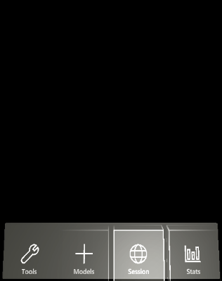
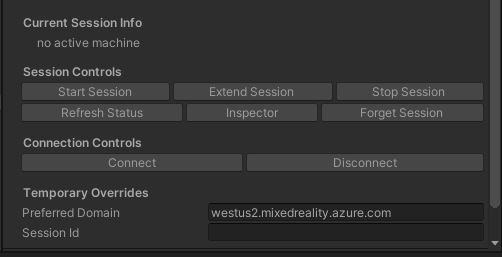
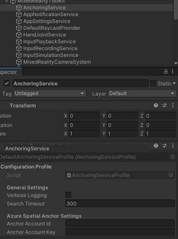
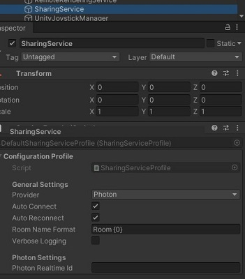

# Azure Remote Rendering Showcase App Sample

## First time setup

To ensure all required Unity packages are available run the `Scripts/DownloadUnityPackages.ps1` PowerShell script before opening the Showcase App Unity project.

## Starting & Configuring Sessions in App

To use this application, you'll have to start a new Azure Remote Rendering session. To start a session click the *session* button, and then click *start session*. Starting a session will take a few minutes. However once the session is ready, the app will automatically connect to it. The app will also remember the created last session, and will automatically connect to this session at start-up.

Within the app, you can also change the [session's size](https://docs.microsoft.com/azure/remote-rendering/reference/limits#overall-number-of-polygons)
 (*Standard* or *Premium*) and [region](https://docs.microsoft.com/azure/remote-rendering/reference/regions). Before starting a session, click the *configure* button. You'll be presented with size and region options. After selecting the desired configuration, click *back* and start a new session.

## Controlling & Configuring Remote Rendering Sessions in Editor

Search for the *RemoteRenderingService* object under the *MixedRealityToolkit* node in the hierarchy window, and select this object. It holds the configuration properties as shown in the next paragraph.

### Configuration

The *RemoteRenderingService* object is a custom Mixed Reality Toolkit (MRTK) [extension service](https://microsoft.github.io/MixedRealityToolkit-Unity/Documentation/Extensions/ExtensionServices.html). As with most MRTK services, the *RemoteRenderingService* object has a configuration profile.

#### Remote Rendering Configuration Profiles

A variety of remote rendering app settings can be changed with this custom profile. The settings are as follows:

| Session Setting | Description |
| :------------------ | :------------------ |
| Size | The ARR session size, either *Standard* or *Premium*. See [limitations of session sizes](https://docs.microsoft.com/azure/remote-rendering/reference/limits#overall-number-of-polygons). |
| Session Override | Either a session guid or a session host name. If specified, the app will attempt to connect to this session. |
| Max Lease Time | The default lease time, in seconds, of the ARR session. If *auto renew lease* is false or the app is disconnected, the session will expire after this time. |
| Auto Renew Lease | If true and the app is connected, the app will attempt to extend the ARR session lease before it expires. |
| Auto Reconnect | If true, the app will attempt to auto reconnect after a disconnection. |
| Auto Reconnect Rate | The rate, in seconds, in which the app will attempt to reconnect after a disconnection. |
| Always Include Default Models | If true, the model list will contain the default models, even when using an override file or a storage account. |

> All settings are optional if their values are set in the [arr.account.xml](../App/Assets/StreamingAssets/arr.account.xml) file. The [arr.account.xml](../App/Assets/StreamingAssets/arr.account.xml) file can be placed under Unity's *StreamingAssets* directory. If this file exists, the app will use the file's settings, instead of those within the configuration profile.
>
> The [arr.account.xml](../App/Assets/StreamingAssets/arr.account.xml) file is not tracked by *git* (as defined in the app's [.gitignore](../.gitignore)), preventing accidental commits of private/secret information. So it is preferred to use [arr.account.xml](../App/Assets/StreamingAssets/arr.account.xml) instead of adding your private account settings to the MRTK's configuration profiles.
>
> Also, the [arr.overrides.xml](.samples/arr.overrides.xml) can be used to override settings even if the app has already been packaged and deployed. For Unity editor overrides, [arr.overrides.xml](.samples/arr.overrides.xml) needs to be placed in the [%USERPROFILE%/AppData/LocalLow/Microsoft/ARR Showcase]() folder. For HoloLens overrides, [arr.overrides.xml](.samples/arr.overrides.xml) needs to be placed in the app's [LocalState](https://docs.microsoft.com/en-us/windows/mixed-reality/using-the-windows-device-portal#file-explorer) folder. The file should only contain the settings you want to override.
>
> The schema for [arr.account.xml](../App/Assets/StreamingAssets/arr.account.xml) and [arr.overrides.xml](.samples/arr.overrides.xml) can be found [here](.schemas/arr.overrides.schema.xds).

Two types of profiles exist to define a Remote Rendering Configuration: Development and Production. These profiles differ in the way account services are accessed. Using a development profile is the quickest way to get started because it uses Account Keys, without additional configuration. Using a production profile is the most secure way to utilize Azure Remote Rendering and Blob storage access because it uses Azure Active Directory to authenticate users. The production profile will require additional Azure configuration, described in the ARR tutorial for [Security](https://docs.microsoft.com/azure/remote-rendering/tutorials/unity/security/security).

#### Development Profile

| Remote Rendering Account Settings (Development) | Description |
| :---------------------- | :------------------------------------------------------------------------- |
| Account Authentication Domain | The [ARR account domain](https://docs.microsoft.com/azure/remote-rendering/how-tos/create-an-account#retrieve-the-account-information).
| Account Domains         | A list of (up to 4) full [ARR rendering domains](https://docs.microsoft.com/azure/remote-rendering/reference/regions) (e.g. westus2.mixedreality.azure.com). The list order defines the order in which the domains are tested.
| Account Id              | The [ARR account ID](https://docs.microsoft.com/azure/remote-rendering/how-tos/create-an-account#retrieve-the-account-information).
| Account Key             | The [ARR account key](https://docs.microsoft.com/azure/remote-rendering/how-tos/create-an-account#retrieve-the-account-information)
| Storage Account Name    | The [ARR storage account name](https://docs.microsoft.com/azure/remote-rendering/how-tos/create-an-account#link-storage-accounts). This account owns the *model container*.
| Storage Account Key     | The Azure Storage Account key. Needed if the *model container* is private.
| Storage Model Container | The Azure Storage Container that contains a set of arrAsset model files.

#### Production Profile

| Remote Rendering Account Settings (Production) | Description |
| :---------------------- | :------------------------------------------------------------------------- |
| Account Authentication Domain | The [ARR account domain](https://docs.microsoft.com/azure/remote-rendering/how-tos/create-an-account#retrieve-the-account-information).
| Account Domains         | A list of (up to 4) full [ARR rendering domains](https://docs.microsoft.com/azure/remote-rendering/reference/regions) (e.g. westus2.mixedreality.azure.com). The list order defines the order in which the domains are tested.
| Account Id                      | The [ARR account ID](https://docs.microsoft.com/azure/remote-rendering/how-tos/create-an-account#retrieve-the-account-information).
| App Id                          | The [Azure AD Application ID](https://docs.microsoft.com/azure/remote-rendering/how-tos/authentication#authentication-for-deployed-applications)
| Tenant Id                       | The [Tenant ID of the Azure AD Application](https://docs.microsoft.com/azure/remote-rendering/how-tos/authentication#authentication-for-deployed-applications)
| Storage Account Name            | The [ARR storage account name](https://docs.microsoft.com/azure/remote-rendering/how-tos/create-an-account#link-storage-accounts). This account owns the *model container*.
| Storage Model Container         | The Azure Storage Container that contains a set of arrAsset model files.
| Storage Model Path By Username  | If checked, models uploaded through the desktop application will be stored in a sub directory matching the user name.

> [!IMPORTANT]
> To be able to load models from the storage account, you must link it to your ARR account. This applies to both profile types. The necessary steps are described on the [__account creation page__](https://docs.microsoft.com/azure/remote-rendering/how-tos/create-an-account#link-storage-accounts) of the Remote Rendering documentation. Please note that this is only necessary for loading models.

Changes to the configuration will be applied to *RemoteRenderingService* during the next app session. For more information about custom MRTK extension services, visit the MRTK [documentation](https://microsoft.github.io/MixedRealityToolkit-Unity/Documentation/Extensions/ExtensionServices.html).

### Play mode

When in 'play' mode, the inspector also shows various buttons to interact with the session, including extend, stop, and forget the current session. Note that "forget" won't stop the remote session, but it'll prevent the app from using this session again.

The *Temporary Overrides* settings apply to the currently playing app session, and are only used to when playing within the editor. The settings are:

| Temporary Setting | Description |
| :------------------ | :------------------ |
| Preferred Domain | If changed, this will be the account domain used when creating a new ARR session. By default this is the first domain in the *Account Domains* list. |
| Session ID | If specified, the app will use this ARR session ID when connecting to the ARR service. This allows for starting a session using some other method, and then connecting to it within ARR Showcase. |

> [!IMPORTANT]
> It is not possible to create or interact with sessions outside the editor's play mode.

## Configuring the Multi-User Experience

ARR Showcase has built-in multi-user support. This experience is built on top of the [Azure Spatial Anchor](https://azure.microsoft.com/en-us/services/spatial-anchors/) service and [Photon's PUN](https://www.photonengine.com/en/PUN) service (note, PUN is not a Microsoft supported service). The application uses [Azure Spatial Anchors](https://azure.microsoft.com/en-us/services/spatial-anchors/) to create sharable anchors, and [PUN](https://www.photonengine.com/en/PUN) to share application state (including the list of Azure Spatial Anchor IDs).

In order to take full advantage of the multi-user experience, an [Azure Spatial Anchor](https://azure.microsoft.com/en-us/services/spatial-anchors/) and [Photon](https://www.photonengine.com/en/PUN) account must be created. Information about creating an Azure Spatial Anchor account can be found [here](https://azure.microsoft.com/en-us/services/spatial-anchors/), and creating a Photon account can be found [here](https://dashboard.photonengine.com/en-US/account/SignUp).

Once the accounts are created, the MRTK's configuration UI can be used to configure the account IDs and keys.

### Azure Spatial Anchor Service

The *AnchoringService* is a custom Mixed Reality Toolkit (MRTK) [extension service](https://microsoft.github.io/MixedRealityToolkit-Unity/Documentation/Extensions/ExtensionServices.html). As with most MRTK services, the *AnchoringService* object has a configuration profile.

#### Configuring Azure Spatial Anchor Service

 A small set of anchoring settings can be changed with this custom profile. Note, for anchors to be shared, the *Anchor Account ID* and *Key* must be set. The settings are as follows:

| Anchoring Setting | Description |
| :---------------------- | :---------------------- |
| Anchor Account ID | The Azure Spatial Anchor account ID. This must be set for the multi-user experience to work. |
| Anchor Account Key | The Azure Spatial Anchor account key. This must be set for the multi-user experience to work. |
| Anchor Account Domain | The Azure Spatial Anchor account domain. This must be set for the multi-user experience to work. |
| Search Timeout | The time, in seconds, to stop searching for a particular Azure Spatial Anchor. If negative, the app will never stop searching for the shared Azure Spatial Anchor. It's a good idea to set to a positive value, so to prevent users at different physical locations from endlessly searching for unfindable anchors. |
| Verbose Logging | When set to true, turns on verbose logging messages for the anchoring service. This is useful when trying to diagnose anchoring failures. |

>The *Anchor Account ID* and *Anchor Account Key* settings are optional if these values are set in the [arr.account.xml](../App/Assets/StreamingAssets/arr.account.xml) file. The [arr.account.xml](../App/Assets/StreamingAssets/arr.account.xml) file can be placed under Unity's *StreamingAssets* directory. If this file exists, the app will use the file's settings, instead of those within the configuration profiles.
>
> The [arr.account.xml](../App/Assets/StreamingAssets/arr.account.xml) file is not tracked by *git* (as defined in the app's [.gitignore](../.gitignore)), preventing accidental commits of private/secret information. So it is preferred to use [arr.account.xml](../App/Assets/StreamingAssets/arr.account.xml) instead of adding your private account settings to the MRTK's configuration profile.
>
> Also, the [arr.overrides.xml](.samples/arr.overrides.xml) can be used to override settings even if the app has already been packaged and deployed. For Unity editor overrides, [arr.overrides.xml](.samples/arr.overrides.xml) needs to be placed in the [%USERPROFILE%/AppData/LocalLow/Microsoft/ARR Showcase]() folder. For HoloLens overrides, [arr.overrides.xml](.samples/arr.overrides.xml) needs to be placed in the app's [LocalState](https://docs.microsoft.com/en-us/windows/mixed-reality/using-the-windows-device-portal#file-explorer) folder. The file should only contain the settings you want to override.
>
> The schema for [arr.account.xml](../App/Assets/StreamingAssets/arr.account.xml) and [arr.overrides.xml](.samples/arr.overrides.xml) can be found [here](.schemas/arr.overrides.schema.xds).

### Sharing Service: A Multi-User Experience

The *SharingService* is a custom Mixed Reality Toolkit (MRTK) [extension service](https://microsoft.github.io/MixedRealityToolkit-Unity/Documentation/Extensions/ExtensionServices.html) that provides a multi-user experience within the application. As with most MRTK services, the *SharingService* object has a configuration profile.

The multi-user experience allows users to connect together, and share their ARR models. Model's are initially positioned via Azure Spatial Anchors, and then their transforms are shared to all connected users. Other data is also shared, such as scene lighting, model materials, and model explosions.

The _Sharing Service_ is an abstraction layer around a set of multi-user APIs. The _Sharing Service_ currently only wraps the Photon Unity Network (PUN) APIs, but can be expanded to support other providers.

> For the sharing experience to function, all users most use the same Azure Remote Rendering and Azure Storage accounts.

#### Installing Photon's PUN SDK

Photon Unity Network (PUN) SDK is required for the _Sharing Service_ to function. The PUN SDK is not included by default. To install the PUN assets, please follow the instructions [here](https://docs.microsoft.com/en-us/windows/mixed-reality/mrlearning-sharing(photon)-ch1#importing-the-photon-assets).

#### Configuring Sharing Service

 A small set of sharing settings can be changed with this custom profile. Note, for the multi-user experience to work, the *Photon Realtime ID* must be set. The settings are as follows:

| Sharing Setting | Description |
| :---------------------- | :---------------------- |
| Auto Connect | If true, the app will automatically connect to the specified sharing provider. If false, the user has to manually create or join a multi-user room. |
| Auto Reconnect | If true, on disconnect, the app will automatically reconnect to the specified sharing provider. If false, the user has to manually create or join a multi-user room on a disconnect. |
| Photon Realtime ID | The Realtime ID for Photon. Since Photon is the only supported sharing service, currently, this value must be set for a functioning multi-user experience. |
| Provider | The *SharingService* is designed to support multiple types of sharing platforms. This enumeration defines which service to use when sharing application state. Currently, only [Photon's PUN](https://www.photonengine.com/en/PUN) is supported. |
| Room Name Format | Room names are automatically created to limit the amount of user input. The room names will use this string format. The format must contain *{0}*. When a room is created, the *{0}* will be replaced with a unique integer. |
| Verbose Logging | When set to true, turns on verbose logging messages for the sharing service. This is useful when trying to diagnose sharing failures.  |

>The *Photon Realtime ID* setting is optional if its value is set in the [arr.account.xml](../App/Assets/StreamingAssets/arr.account.xml) file. The [arr.account.xml](../App/Assets/StreamingAssets/arr.account.xml) file can be placed under Unity's *StreamingAssets* directory. If this file exists, the app will use the file's settings, instead of those within the configuration profiles.
>
> The [arr.account.xml](../App/Assets/StreamingAssets/arr.account.xml) file is not tracked by *git* (as defined in the app's [.gitignore](../.gitignore)), preventing accidental commits of private/secret information. So it is preferred to use [arr.account.xml](../App/Assets/StreamingAssets/arr.account.xml) instead of adding your private account settings to the MRTK's configuration profile.
>
> Also, the [arr.overrides.xml](.samples/arr.overrides.xml) can be used to override settings even if the app has already been packaged and deployed. For Unity editor and Desktop overrides, [arr.overrides.xml](.samples/arr.overrides.xml) needs to be placed in the [%USERPROFILE%/AppData/LocalLow/Microsoft/ARR Showcase]() folder. For HoloLens overrides, [arr.overrides.xml](.samples/arr.overrides.xml) needs to be placed in the app's [LocalState](https://docs.microsoft.com/en-us/windows/mixed-reality/using-the-windows-device-portal#file-explorer) folder. The file should only contain the settings you want to override.
>
> The schema for [arr.account.xml](../App/Assets/StreamingAssets/arr.account.xml) and [arr.overrides.xml](.samples/arr.overrides.xml) can be found [here](.schemas/arr.overrides.schema.xds).

## Voice Commands

Here are all the general voice commands supported by the sample app:

| Command | Description |
| :------------------------- | :------------------------- |
| Showcase, Erase All | Deletes all models from the scene |
| Showcase, Show Hands | Shows hand mesh |
| Showcase, Hide Hands | Hides hand mesh |
| Showcase, Show Local Stats | Shows the MRTK diag window|
| Showcase, Hide Local Stats | Hides the MRTK diag window |
| Showcase, Show Stage | Show and move the local stage visual. Once visible, all new models will be loaded on the stage. |
| Showcase, Hide Stage | Hides the local stage visual. Once hidden, all new models will have to be placed individually. |
| Showcase, Move Stage | Show and move the local stage visual. Once visible, all new models will be loaded on the stage. |
| Showcase, Show Menu | Show the main menu |
| Showcase, Hide Menu | Hide the main menu |
| Showcase, Quit | Quits the application |
| Showcase, Tools | Show or hide the tools menu. |
| Showcase, Models | Show or hide the models menu. |
| Showcase, Session | Show or hide the session menu. |
| Showcase, Stats | Show or hide the stats menu. |

Here are all the tool 'mode' voice commands supported by the app. These change the mode of the pointer.

| Command | Description |
| :------------------------- | :------------------------- |
| Showcase, No Tool | Unselects the current pointer tool, so you can no longer interact with the models. |
| Showcase, Clip | Puts the pointer into clip or slice mode. This also turns on a single clipping plane. |
| Showcase, Erase | Puts the pointer into erase mode. When a model is clicked, the entire model will be deleted from the scene. |
| Showcase, Explode | Puts the pointer into explode mode. When a model is clicked, its pieces will explode outward from the center. |
| Showcase, Move All | Puts the pointer into move mode. When a model is clicked and held, the entire model will be moved, scaled, or rotated. |
| Showcase, Move Piece | Puts the pointer into move piece mode. When a model piece is clicked and held, the piece will be moved, scaled, or rotated. |
| Showcase, Revert | Puts the pointer into revert mode. When a model is clicked, the model pieces will return to the original position relative to the model's root. |
| Showcase, Reset | Puts the pointer into revert mode. When a model is clicked, the model pieces will return to the original position relative to the model's root. |
| Showcase, Slice | Puts the pointer into clip or slice mode. This also turns on a single clipping plane. |

Here are all the multi-user voice commands:

| Command | Description |
| :------------------------- | :------------------------- |
| Showcase, Start Presenting | Make the local user a presenter, if there no an active presentation. The app menu is hidden for all non-presenters, and all non-presenters cannot interact with the app's models. |
| Showcase, Start Collaboration | Make the local user a presenter, if there no active presentation. The app menu is hidden for all non-presenters. All non-presenters can interact with the app's models, but the tool selection is controlled by the presenter. |
| Showcase, Stop Presenting | Stop all presenting and collaborations. The app menu is made visible to all users, and all users can interact with the app's models. |
| Showcase, All Players Move Stage | Makes the stage visible, and forces all other users to place their stage visual. This command is useful when hosting a presentation, and all users are in different locations. |

## App Features

This sample app has the following features:

### HoloLens

| Feature | Description |
| :-------------| :----------- |
| Session Management | Start, stop, and configure ARR sessions. |
| Session Status | View the session's lifetime, and various other performance statistics |
| Search Azure Containers | Search Azure containers for arrAsset models, and display the model names within the app's model menu. From the model menu, you can load these models. |
| Multiple Models | View multiple models at once.
| Manipulate Whole Model | Use MRTK's near and far interactions to move, rotate, and scale whole models.
| Manipulate Model Pieces | Use MRTK's near and far interactions to move, rotate, and scale model pieces.
| Slice Tool | Turn on a clipping plane that can be moved and rotated with MRTK's near and far interactions.
| Model Explosion | For easier access of pieces, explode a model.
| Change Model Materials | Change model pieces' materials.
| Reset Models | Reset a model so its pieces return to their original positions and materials.
| Erase Models | Erase whole models from the scene.
| Change Sky Map | Change the scene's sky map to a predefined set of cube maps.
| Add light sources | Add point lights, directional lights, and spotlights to the scene.

### Desktop

| Feature | Description |
| :-------------| :----------- |
| Session Management | Start, stop, and configure ARR sessions. |
| Session Status | View the session's lifetime, and various other performance statistics |
| Search Azure Containers | Search Azure containers for arrAsset models, and display the model names within the app's model menu. From the model menu, you can load these models. |
| Multiple Models | View multiple models at once.
| Manipulate Whole Model | Use MRTK's far interactions to move models.
| Manipulate Model Pieces | Use MRTK's far interactions to move model pieces.
| Slice Tool | Turn on a clipping plane that can be moved and rotated with MRTK's far interactions.
| Model Explosion | For easier access of pieces, explode a model.
| Change Model Materials | Change model pieces' materials.
| Reset Models | Reset a model so its pieces return to their original positions and materials.
| Erase Models | Erase whole models from the scene.
| Change Sky Map | Change the scene's sky map to a predefined set of cube maps.
| Add light sources | Add point lights, directional lights, and spotlights to the scene.
| Upload Models | Select supported source model to upload and convert it into an ARR model.
| Reset Camera | Resets the camera to the initial position.
