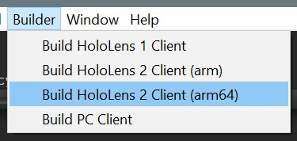

# Getting Started
This sample app is a simple model viewer that demonstrates various Azure Remote Rendering (ARR) features. To use this sample, please follow these setup steps:

1.  Open the *App* directory with Unity 2019.3
2.  Switch Unity's platform to "Universal Windows Platform" by using the *File > Build Settings...* menu item.
3.  Open the *SampleScene* scene
4.  Find the *MixedRealityToolkit* object within the scene hierarchy, select it to show the MRTK configuration in the inspector window.\

5.  In the *RemoteRenderingService* configuration, enter your Azure Remote Rendering Domains, Account Domain, ID, and Key.
6.  (Optional) In the *RemoteRenderingService* configuration, enter your Azure Storage Account Name, Key, and Container Name. This information is optional. If provided, all arrAsset models in the Azure container will be listed within the app's model menu.

# Required Software
1. [Visual Studio 2019](https://developer.microsoft.com/en-us/)
2. [Windows SDK 18362+](https://developer.microsoft.com/en-us/windows/downloads/windows-10-sdk)
3. [Unity 2019.3.x](https://unity3d.com/get-unity/download/archive)

# Building an Appx
You can build the Unity project using the typical HoloLens build process, or you can use the app's build utility under the "Build" menu.

Manual building can be done with the Unity Build Menu. For Desktop, select SampleSceneDesktop scene as the only scene in the build. You will also need to disable VR support in the Project Settings->Player->XR Settings menu. For HoloLens, select SampleScene scene as the only scene in the build. Ensure that VR support is enabled in the Project Settings->Player->XR Settings menu.

# Getting Around
Please visit this [page](.documents/app-usage.md) for instructions on how to use the sample app, and visit this [page](.documents/app-directories.md) for information on the app's source directories.

# Mixed Reality Toolkit Integration
The app has a strong dependency on the Mixed Reality Toolkit (MRTK). The app uses the MRTK's service extensions for integrating with ARR. That is, a custom service extension, [IRemoteRenderingService](./App/Assets/App/Services/Interfaces/IRemoteRenderingService.cs), was created for starting, stopping, extending, and connecting to ARR sessions.

The app also uses the MRTK's input system for interacting with remote ARR entities, without relying on Unity colliders. This was accomplished by creating a custom MRTK focus provider, [RemoteFocusProviderNoCollider](./App/Assets/App/Focus/RemoteFocusProviderNoColliders.cs). This focus provider executes remote ray casts for each of the active MRTK pointers, at a rate of 30 Hz, and determines if a remote or local object should receive a pointer's focus.

The MRTK's input system is also used to limit the number of game objects needed for ARR entities. This is accomplished by dynamically creating game objects for entities that have MRTK's pointer focus. Once an entity loses focus, its associated game object is destroyed. For more information about this behavior see the [RemoteObjectExpander](./App/Assets/App/RemoteObject/RemoteObjectExpander.cs) component. 
